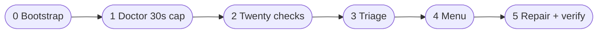

<div align="center">

# ClawICU

### *The emergency room for your [OpenClaw](https://github.com/openclaw/openclaw) gateway.*

One command. Twenty checks. Six phases. Back from the brink.

<br/>

[](https://xagent.icu/r)
[](https://xagent.icu/docs)
[](https://opensource.org/licenses/MIT)
[](https://xagent.icu/download)

<br/>

[**Run it now**](https://xagent.icu/r) · [**Website**](https://xagent.icu) · [**Docs**](https://xagent.icu/docs) · [**Rescue walkthrough**](https://xagent.icu/rescue) · [**SOS / Share**](https://xagent.icu/sos) · [**Download**](https://xagent.icu/download)

</div>

---

## Why this exists

Your gateway was fine yesterday. Today: **plugins throwing `api.config.get`**, **`openclaw doctor` hangs forever**, Discord silently ignores DMs, **18789** looks “busy” but isn’t yours, **`plugins.allow` is empty**, CLI and gateway **don’t match versions** — and you’re grepping JSON5 at 2 a.m.

> **ClawICU doesn’t replace OpenClaw.** It’s the stretcher team: triage → diagnose → treat → verify — with backups, menus that work even through `curl | sh`, and a doctor pass that **won’t hang your terminal**.

---

## Run it (copy once, use everywhere)

```bash
curl -fsSL https://xagent.icu/r | sh
```

<details>
<summary><strong>Alternatives</strong></summary>

```bash
# Explicit script URL (same bytes as /r)
curl -fsSL https://xagent.icu/rescue.sh | sh

# Save, inspect, then run
curl -fsSL https://xagent.icu/r -o rescue.sh && chmod +x rescue.sh && ./rescue.sh
```

</details>

**POSIX `sh`** · **stdin reattached to `/dev/tty`** so interactive menus work when piped · **Automatic backups** before risky repairs where applicable.

---

## What you get (at a glance)

| | |
|:---|:---|
| **20 diagnostic modules** | Config (JSON5), gateway `/healthz`, plugins & SDK, credentials, daemon (systemd / launchd), version skew, port **18789** (skips OpenClaw’s own listener), disk, channel policy, env, exec approvals, … |
| **6-phase protocol** | Bootstrap → crash-safe **doctor (~30s timeout)** → standalone checks → triage “vital signs” → **interactive** treatment menu → execute repairs + verify |
| **Real repairs** | e.g. disable crashing plugins, fill **`plugins.allow`**, restart gateway for mismatch, tune channel policy paths — not just pretty logs |
| **25 issue guides** | Deep pages on [xagent.icu/docs](https://xagent.icu/docs) — bookmark the one that matches your outage |
| **ICU-themed site + SEO** | Landing, docs, sitemap, structured data — built with Next.js static export |
| **Share “SOS”** | [xagent.icu/sos](https://xagent.icu/sos) + Open Graph card for quick **Share to X** from the homepage CTA |

---

## The six phases (flow)



| # | Phase | In one line |
|---|--------|-------------|
| 0 | **Bootstrap** | OS, install flavor, temp workspace, logging. |
| 1 | **Doctor** | `openclaw doctor` with **timeout**; bad plugins can’t freeze the whole run. |
| 2 | **Checks** | **20** independent modules — not “one command said OK”. |
| 3 | **Triage** | Fatal / warn / info rolled into a single “patient chart”. |
| 4 | **Menu** | Auto · Quick · Full · Nuclear · Export · Quit — **works via pipe**. |
| 5 | **Execute** | Targeted fixes + **re-verify** after changes. |

**Also on the site (not a numbered phase):** [Tool Unlock Panel](https://xagent.icu/docs/tool-unlock-panel) — exec / browser / elevated / sandbox via `openclaw config`.

---

## Under the hood (repo map)

```
rescue/                    # Modular checks + repairs + lib
scripts/build-rescue.sh  # → dist/rescue.sh (inlined for curl | sh)
public/rescue.sh         # Copy served by the static site
src/                     # Next.js → static export to out/
public/sos-card.svg      # Social share art → npm run build:share-card → .png
```

Rebuild bundle after editing `rescue/`:

```bash
sh scripts/build-rescue.sh && cp dist/rescue.sh public/rescue.sh
```

---

## Hack on the website

```bash
git clone https://github.com/SonicBotMan/clawicu.git && cd clawicu
npm install
npm run dev              # http://localhost:3000
npm run build            # → out/

# Regenerate Twitter/OG PNG after editing public/sos-card.svg (needs Chrome/Chromium)
npm run build:share-card
```

---

## Contributing

Spotted a new failure mode or a bad heuristic? **[Open an issue](https://github.com/SonicBotMan/clawicu/issues)** — PRs welcome.

---

<div align="center">

**MIT License** · Made for operators who ship fast and fix faster.

*ClawICU — when OpenClaw codes red, we go green.*

</div>

---

<br/>

<div align="center">

# 中文版

### *你的 [OpenClaw](https://github.com/openclaw/openclaw) 网关「急救室」。*

一条命令 · 二十项检查 · 六个阶段 · 把线上救回来。

<br/>

[**立即执行**](https://xagent.icu/r) · [**官网**](https://xagent.icu) · [**文档**](https://xagent.icu/docs) · [**救援流程**](https://xagent.icu/rescue) · [**SOS 分享**](https://xagent.icu/sos) · [**下载**](https://xagent.icu/download)

</div>

---

## 为什么需要它

网关昨天还好好的：今天可能是 **插件崩在 `api.config.get`**、**`openclaw doctor` 卡死**、Discord **策略导致消息全吞**、**18789 端口误报冲突**、**`plugins.allow` 为空**、CLI 与 Gateway **版本不一致**……你在凌晨两点对着 JSON5 和日志发呆。

> **ClawICU 不替代 OpenClaw**，而是 **分诊 → 检查 → 处置 → 复核**：带 **超时** 的 doctor、**20** 个独立检查模块、**`curl | sh` 下仍可交互**的菜单，以及变更前的 **备份** 习惯。

---

## 一条命令

```bash
curl -fsSL https://xagent.icu/r | sh
```

也可使用 `https://xagent.icu/rescue.sh`（与 `/r` 同源）。脚本为 **POSIX sh**，会从 **`/dev/tty`** 读菜单，管道执行不会「秒选默认项」。

---

## 你能得到什么

- **20** 个诊断模块：JSON5 配置、网关 **`/healthz`**、插件与 SDK、凭据、守护进程、版本不一致、端口（会识别是否为 OpenClaw 自身占用）、磁盘、频道策略等。  
- **6** 个阶段：Bootstrap → **30 秒超时** doctor → 独立检查 → 分诊 → **交互式**处置方案 → 修复与验证。  
- **25** 篇故障百科：[xagent.icu/docs](https://xagent.icu/docs)。  
- **SOS 落地页** + 分享卡片：[xagent.icu/sos](https://xagent.icu/sos)（适合转发求助）。  
- 官网与文档站：**Next.js 静态导出**，含 SEO 与站点地图。

---

## 六个阶段（与英文版一致）

| # | 阶段 | 一句话 |
|---|------|--------|
| 0 | 引导 | 系统与安装方式、临时目录、日志。 |
| 1 | Doctor | `openclaw doctor`，**超时保护**，输出写入后续阶段使用。 |
| 2 | 检查 | **20** 个模块并行于 doctor 结论，交叉验证。 |
| 3 | 分诊 | 致命 / 警告 / 信息汇总成「体征面板」。 |
| 4 | 菜单 | 自动 / 快速 / 完整 / 核选项等，**管道下可交互**。 |
| 5 | 执行 | 定向修复 + 再验证。 |

工具权限相关另见：[工具解锁面板文档](https://xagent.icu/docs/tool-unlock-panel)。

---

## 开发与同步

```bash
git clone https://github.com/SonicBotMan/clawicu.git && cd clawicu
npm install && npm run dev
# 修改 rescue/ 后：
sh scripts/build-rescue.sh && cp dist/rescue.sh public/rescue.sh
# 修改分享卡 SVG 后（需本机 Chrome/Chromium）：
npm run build:share-card
```

欢迎 **[提交 Issue](https://github.com/SonicBotMan/clawicu/issues)** 或 PR。

---

<div align="center">

**MIT License** · 脚本当前版本 **0.2.0**（见 `CLAWICU_VERSION`）

*OpenClaw 红灯时，我们帮你拉回绿区。*

</div>
